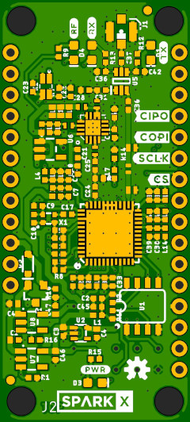
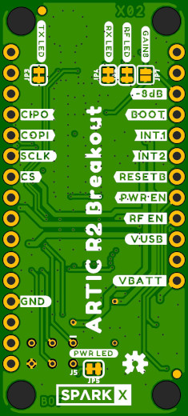

# ARGOS ARTIC R2 Breakout

The [ARGOS ARTIC R2 satellite communication chipset](https://www.cls-telemetry.com/argos-solutions/argos-products/modems/artic-chipset/#1534863095666-398318f3-c367) in Thing Plus format.

_Dimensions are in inches_

The ARTIC-R2 is an integrated low power small size ARGOS 2/3/4 single chip radio. ARTIC-R2 implements a message based wireless interface. For satellite uplink communication, ARTIC-R2 will encode, modulate and transmit provided user messages. For downlink communication, ARTIC-R2 will lock to the downstream, demodulate and decode it and extract the satellite messages.

The ARTIC-R2 can transmit signals in frequency bands around 400MHz and receive signals in the bands around 466MHz, in accordance with the ARGOS satellite system specifications. The ARTIC-R2 is compliant to all ARGOS 3 and ARGOS 4 RX and TX standards. It contains a RF transceiver and frequency synthesizer and a digital baseband modem. The ARTIC-R2 contains an on-chip power amplifier delivering 1mW [0dBm] output power, that serves as an output for connecting an external high efficient PA. The (de)modulation algorithms run on an on-chip DSP. This software approach allows for retargeting the ARTIC for other applications. The DSP program can be retained on an external flash or the MCU.

- Serial interface (SPI) for communication with MCU
- Programmable DSP core on board to ensure flexibility
- RX frequency : 466MHz – TX frequency: 400MHz
- Fractional N frequency synthesis
- Supported TX standards:
  - BPSK: PTT-A2 (ARGOS 2), PTT-VLD (ARGOS 4)
  - QPSK: PTT-A3, PTT-ZE (ARGOS 3)
  - GMSK: PTT-HD (ARGOS 3), PTT-MD (ARGOS 4), PTT-HD (ARGOS 4)
- Supported RX standards:
  - BPSK: PMT-A3 (ARGOS 3)
  - DSSS OQPSK: PMT-A4 (ARGOS 4) not available
- Dedicated flash Interface to retain Firmware
- Support COSPAS-SARSAT standard
- Operates on external 26MHz reference clock
- Dual supply, 1.8V and 3.3V
- Integrated PA (0dBm) to combine with external PA

An RFPA0133 programmable gain power amplifier boosts the 0dBm (1mW) output from the ARTIC by approximately 26.5dB, producing a transmit power level of approximately 450mW. The transmit power can be reduced by 8dB by applying 3.3V to the **-8dB** breakout pin, reducing the transmit current draw by approximately 80mA.

The ARGOS satellite system is restricted to specific programs and applications. Please check that your project meets these requirements before buying hardware. CLS and the Woods Hole Group will be able to advise if your project meets the requirements.
- _**"To meet system use requirements, all programs using Argos have to be related in some way or other to environmental protection, awareness or study, or to protecting human life."**_

## Breakout Pins

- **VBATT**: Power input from (e.g.) a LiPo battery. Typically 3.6V - 4.2V.
- **VUSB**: Power input from USB. Typically 5V. 6.5V maximum.
- **GND**: Power ground / 0V.
- **RF EN**: Pulled low via a 100k resistor. Pull up to 3.3V to enable power for the RF amplifier.
- **PWR EN**: Pulled low via a 100k resistor. Pull up to 3.3V to enable power for the ARTIC R2.
- **RESETB**: Connected to the ARTIC reset pin. Pulled up to 3.3V via a 100k resistor. Pull low to reset the ARTIC.
- **INT2**: Connected to the ARTIC INT2 pin. Will be pulled up to 3.3V by the ARTIC to indicate (e.g.) an RX_BUFFER_OVERFLOW.
- **INT1**: Connected to the ARTIC INT1 pin. Will be pulled up to 3.3V by the ARTIC to indicate (e.g.) an RX_VALID_MESSAGE.
- **BOOT**: Connected to the ARTIC BOOT pin. Pulled up to 3.3V via a 100k resistor. When high, the ARTIC boots from the on-board flash memory. Pull low if the ARTIC firmware will be downloaded by the MCU via SPI.
- **-8dB**: Pull up to 3.3V to reduce the transmit power by 8dB. The amplifier will use full power if this pin is pulled low or left open.
- **CIPO**: SPI interface: Controller In Peripheral Out. 3.3V.
- **COPI**: SPI interface: Controller Out Peripheral In. 3.3V.
- **SCLK**: SPI interface clock signal. Typically 1MHz. 3.3V. See the ARTIC R2 datasheet for the permitted clock speeds.
- **CS**: SPI interface Chip Select. 3.3V. Active low.

Power can be provided via the VBATT pin or the VUSB pin, or both. The breakout will preferentially draw power from USB if connected.

## LEDs

- **PWR**: ARTIC R2 power
- **RF**: RF amplifier power
- **TX**: ARTIC is transmitting
- **RX**: ARTIC is receiving

The LEDs can be disabled to save power by cutting the jumper links on the bottom of the PCB.

## Antenna

The antenna is connected via a uFL connector. A 400MHz quarter wave wire antenna is all that is required for most applications.

## Arduino Library

The [SparkFun ARGOS ARTIC R2 Arduino Library](https://github.com/sparkfun/SparkFun_ARGOS_ARTIC_R2_Arduino_Library) contains a full set of examples
to get you up and running with the ARTIC R2 Breakout.

## Hook-Up Guide

The ARTIC R2 Breakout is designed to interface directly to a SparkFun Thing Plus board. The
[examples in the Arduino library](https://github.com/sparkfun/SparkFun_ARGOS_ARTIC_R2_Arduino_Library/tree/master/examples) are written for the
[Thing Plus - Artemis](https://www.sparkfun.com/products/15574) but can be adapted to any board simply by changing the declared pin numbers.

You can mount the ARTIC R2 Breakout on a Thing Plus board using [Break Away Headers - Straight](https://www.sparkfun.com/products/116) on the ARTIC
and [Female Headers](https://www.sparkfun.com/products/115) on the Thing Plus. That way you can remove the ARTIC R2 Breakout if you want to and perhaps
mount the board on a [Breadboard](https://www.sparkfun.com/products/12002) instead.

If you are new to Arduino and the IDE, these guides will get you up and running:
- [Hookup Guide for the SparkFun Artemis Thing Plus](https://learn.sparkfun.com/tutorials/hookup-guide-for-the-sparkfun-artemis-thing-plus)
- [Artemis Development with Arduino](https://learn.sparkfun.com/tutorials/artemis-development-with-arduino)
- [https://learn.sparkfun.com/tutorials/installing-an-arduino-library](Installing an Arduino Library)

In the Arduino IDE, please make sure you select the correct board. The examples in the Arduino library assume you will be using the _SparkFun Artemis Thing Plus_
from the _SparkFun Apollo3_ boards package.

You can install the library using the IDE by opening _**Tools\Manage Libraries**_ and then searching for _SparkFun ARGOS ARTIC R2_.

## Repository Contents

- [**/Documents**](./Documents) - Datasheets etc.
- [**/Hardware**](./Hardware) - Eagle PCB, SCH and LBR design files
- [**LICENSE.md**](./LICENSE,md) - contains the licence information

## Thanks

The ARTIC R2 breakout is a remix of the reference design kindly provided by the Arribada Initiative and Icoteq Ltd.
