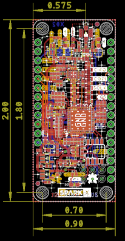

# ARGOS Satellite Transceiver Shield

The [ARGOS ARTIC R2 satellite communication chipset](https://www.cls-telemetry.com/argos-solutions/argos-products/modems/artic-chipset/#1534863095666-398318f3-c367) in Thing Plus format.

[*SparkX ARGOS Satellite Transceiver Shield (SPX-17236)*](https://www.sparkfun.com/products/17236)

_Dimensions are in inches_  

The ARTIC-R2 is an integrated low power small size ARGOS 2/3/4 single chip radio. ARTIC-R2 implements a message based wireless interface. For satellite uplink communication, ARTIC-R2 will encode, modulate and transmit provided user messages. For downlink communication, ARTIC-R2 will lock to the downstream, demodulate and decode it and extract the satellite messages.

The ARTIC-R2 can transmit signals in frequency bands around 400MHz and receive signals in the bands around 466MHz, in accordance with the ARGOS satellite system specifications. The ARTIC-R2 is compliant to all ARGOS 3 and ARGOS 4 RX and TX standards. It contains a RF transceiver and frequency synthesizer and a digital baseband modem. The ARTIC-R2 contains an on-chip power amplifier delivering 1mW [0dBm] output power, that serves as an output for connecting an external high efficient PA. The (de)modulation algorithms run on an on-chip DSP. This software approach allows for retargeting the ARTIC for other applications. The DSP program can be retained on an external flash or the MCU.

- Serial interface (SPI) for communication with MCU
- Programmable DSP core on board to ensure flexibility
- RX frequency : 466MHz – TX frequency: 400MHz
- Fractional N frequency synthesis
- Supported TX standards:
  - BPSK: PTT-A2 (ARGOS 2), PTT-VLD (ARGOS 4)
  - QPSK: PTT-A3, PTT-ZE (ARGOS 3)
  - GMSK: PTT-HD (ARGOS 3), PTT-MD (ARGOS 4), PTT-HD (ARGOS 4)
- Supported RX standards:
  - BPSK: PMT-A3 (ARGOS 3)
  - DSSS OQPSK: PMT-A4 (ARGOS 4) not available
- Dedicated flash Interface to retain Firmware
- Support COSPAS-SARSAT standard
- Operates on external 26MHz reference clock
- Dual supply, 1.8V and 3.3V
- Integrated PA (0dBm) to combine with external PA

An RFPA0133 programmable gain power amplifier boosts the 0dBm (1mW) output from the ARTIC by up to 26dB, producing a maximum transmit power level of 400mW. The transmit power can be adjusted via the **G8** breakout pin.

The ARGOS satellite system is **currently** restricted to specific programs and applications. Please check that your project meets these requirements before buying hardware. [CLS (France)](https://www.cls-telemetry.com/argos-solutions/) and the [Woods Hole Group (America)](https://www.clsamerica.com/science-with-argos) will be able to advise if your project meets the requirements.
- _**"To meet system use requirements, all programs using Argos have to be related in some way or other to environmental protection, awareness or study, or to protecting human life."**_

## Repository Contents

- [**/Documents**](./Documents) - Datasheets, test certificates etc.
- [**/Hardware**](./Hardware) - Eagle PCB, SCH and LBR design files
- [**LICENSE.md**](./LICENSE,md) - contains the licence information

## Documentation

- [**Arduino Library**](https://github.com/sparkfun/SparkFun_ARGOS_ARTIC_R2_Arduino_Library) - SparkFun ARGOS ARTIC R2 Arduino Library
- [**Hookup Guide**](https://learn.sparkfun.com/tutorials/argos-artic-r2-satellite-transceiver-shield-hookup-guide) - a hookup guide for the SparkFun ARGOS Satellite Transceiver Shield - ARTIC R2

## Thanks

The SparkX ARGOS Satellite Transceiver Shield is a remix of the reference design kindly provided by the Arribada Initiative and Icoteq Ltd.

## License Information

This product is _**open source**_! 

Please review the LICENSE.md file for license information. 

If you have any questions or concerns on licensing, please contact technical support on our [SparkFun forums](https://forum.sparkfun.com/viewforum.php?f=152).

Distributed as-is; no warranty is given.

- Your friends at SparkFun.
