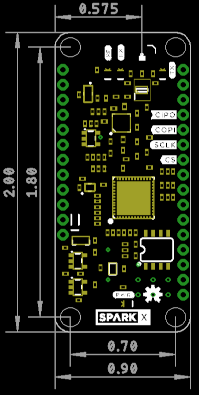
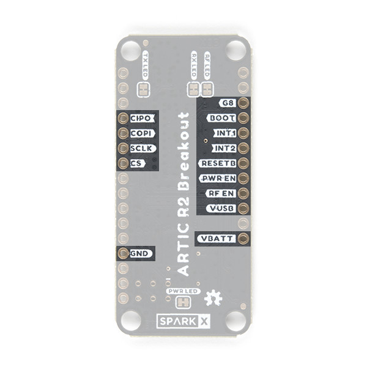
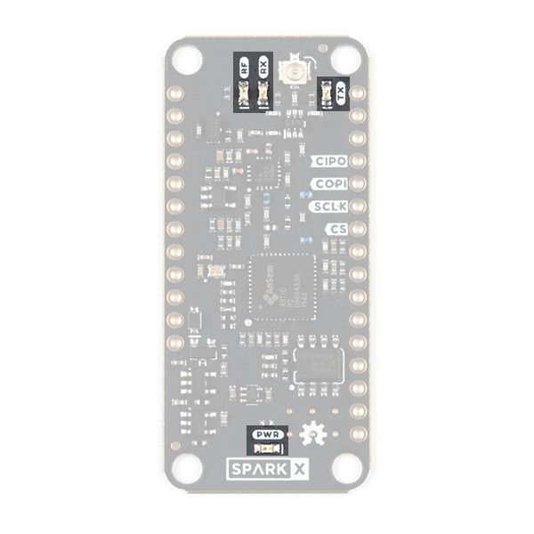

# ARGOS Satellite Transceiver Shield

The [ARGOS ARTIC R2 satellite communication chipset](https://www.cls-telemetry.com/argos-solutions/argos-products/modems/artic-chipset/#1534863095666-398318f3-c367) in Thing Plus format.

_Dimensions are in inches_  

The ARTIC-R2 is an integrated low power small size ARGOS 2/3/4 single chip radio. ARTIC-R2 implements a message based wireless interface. For satellite uplink communication, ARTIC-R2 will encode, modulate and transmit provided user messages. For downlink communication, ARTIC-R2 will lock to the downstream, demodulate and decode it and extract the satellite messages.

The ARTIC-R2 can transmit signals in frequency bands around 400MHz and receive signals in the bands around 466MHz, in accordance with the ARGOS satellite system specifications. The ARTIC-R2 is compliant to all ARGOS 3 and ARGOS 4 RX and TX standards. It contains a RF transceiver and frequency synthesizer and a digital baseband modem. The ARTIC-R2 contains an on-chip power amplifier delivering 1mW [0dBm] output power, that serves as an output for connecting an external high efficient PA. The (de)modulation algorithms run on an on-chip DSP. This software approach allows for retargeting the ARTIC for other applications. The DSP program can be retained on an external flash or the MCU.

- Serial interface (SPI) for communication with MCU
- Programmable DSP core on board to ensure flexibility
- RX frequency : 466MHz – TX frequency: 400MHz
- Fractional N frequency synthesis
- Supported TX standards:
  - BPSK: PTT-A2 (ARGOS 2), PTT-VLD (ARGOS 4)
  - QPSK: PTT-A3, PTT-ZE (ARGOS 3)
  - GMSK: PTT-HD (ARGOS 3), PTT-MD (ARGOS 4), PTT-HD (ARGOS 4)
- Supported RX standards:
  - BPSK: PMT-A3 (ARGOS 3)
  - DSSS OQPSK: PMT-A4 (ARGOS 4) not available
- Dedicated flash Interface to retain Firmware
- Support COSPAS-SARSAT standard
- Operates on external 26MHz reference clock
- Dual supply, 1.8V and 3.3V
- Integrated PA (0dBm) to combine with external PA

An RFPA0133 programmable gain power amplifier boosts the 0dBm (1mW) output from the ARTIC by _approximately_ 26.5dB, producing a transmit power level of _approximately_ 450mW. The transmit power can be adjusted via the **G8** breakout pin.

The ARGOS satellite system is restricted to specific programs and applications. Please check that your project meets these requirements before buying hardware. [CLS (France)](https://www.cls-telemetry.com/argos-solutions/) and the [Woods Hole Group (America)](https://www.clsamerica.com/science-with-argos) will be able to advise if your project meets the requirements.
- _**"To meet system use requirements, all programs using Argos have to be related in some way or other to environmental protection, awareness or study, or to protecting human life."**_

## Breakout Pins

- **CIPO**: SPI interface: Controller In Peripheral Out. 3.3V.
- **COPI**: SPI interface: Controller Out Peripheral In. 3.3V.
- **SCLK**: SPI interface clock signal. Typically 1MHz. 3.3V. See the ARTIC R2 datasheet for the permitted clock speeds.
- **CS**: SPI interface Chip Select. 3.3V. Active low.
- **GND**: Power ground / 0V.
- **G8**: Pull up to 3.3V to set the RFPA0133 transmit power to maximum. The transmit power will be reduced by _approximately_ 5dB if this pin is pulled low or left open.
- **BOOT**: Connected to the ARTIC BOOT pin. Pulled up to 3.3V via a 100k resistor. When high, the ARTIC boots from the on-board flash memory. Pull low if the ARTIC firmware will be downloaded by the MCU via SPI.
- **INT1**: Connected to the ARTIC INT1 pin. Will be pulled up to 3.3V by the ARTIC to indicate (e.g.) an RX_VALID_MESSAGE.
- **INT2**: Connected to the ARTIC INT2 pin. Will be pulled up to 3.3V by the ARTIC to indicate (e.g.) an RX_BUFFER_OVERFLOW.
- **RESETB**: Connected to the ARTIC reset pin. Pulled up to 3.3V via a 100k resistor. Pull low to reset the ARTIC.
- **PWR EN**: Pulled low via a 100k resistor. Pull up to 3.3V to enable power for the ARTIC R2.
- **RF EN**: Pulled low via a 100k resistor. Pull up to 3.3V to enable power for the RF amplifier.
- **VUSB**: Power input from (e.g.) USB. **Typically 5V. 6.5V maximum.**
- **VBATT**: Power input from (e.g.) a LiPo battery. **Typically 3.6V - 4.2V. 6.5V maximum.**

Power can be provided via the VBATT pin or the VUSB pin, or both. The breakout will preferentially draw power from USB if connected. On-board 3.3V regulators regulate USB or battery power down to 3.3V for the ARTIC and RF amplifier.
See below for the typical VUSB current draw.

The full schematic for the ARTIC R2 Breakout is available [here](./Hardware/Schematic.pdf).

## LEDs

- **RF**: RF amplifier power
- **RX**: ARTIC is receiving
- **TX**: ARTIC is transmitting
- **PWR**: ARTIC R2 power

The LEDs can be disabled to save power by cutting the jumper links on the bottom of the PCB.

## Antenna

The antenna is connected via a uFL connector. A 400MHz quarter wave wire antenna is all that is required for most applications.

## Arduino Library

The [SparkFun ARGOS ARTIC R2 Arduino Library](https://github.com/sparkfun/SparkFun_ARGOS_ARTIC_R2_Arduino_Library) contains a full set of examples
to get you up and running with the ARTIC R2 Breakout.

## Hook-Up Guide

The ARTIC R2 Breakout is designed to interface directly to a SparkFun Thing Plus board. The
[examples in the Arduino library](https://github.com/sparkfun/SparkFun_ARGOS_ARTIC_R2_Arduino_Library/tree/master/examples) are written for the
[Thing Plus - Artemis](https://www.sparkfun.com/products/15574) but can be adapted to any board simply by changing the declared pin numbers.

You can mount the ARTIC R2 Breakout on a Thing Plus board using [Break Away Headers - Straight](https://www.sparkfun.com/products/116) on the ARTIC
and [Female Headers](https://www.sparkfun.com/products/115) on the Thing Plus. That way you can remove the ARTIC R2 Breakout if you want to and perhaps
mount the board on a [Breadboard](https://www.sparkfun.com/products/12002) instead.

If you are new to Arduino and the IDE, these guides will get you up and running:
- [Hookup Guide for the SparkFun Artemis Thing Plus](https://learn.sparkfun.com/tutorials/hookup-guide-for-the-sparkfun-artemis-thing-plus)
- [Artemis Development with Arduino](https://learn.sparkfun.com/tutorials/artemis-development-with-arduino)
- [Installing an Arduino Library](https://learn.sparkfun.com/tutorials/installing-an-arduino-library)

In the Arduino IDE, please make sure you select the correct board. The examples in the Arduino library assume you will be using the _SparkFun Artemis Thing Plus_
from the _SparkFun Apollo3_ boards package.

You can install the library using the IDE by opening _**Tools\Manage Libraries**_ and then searching for _SparkFun ARGOS ARTIC R2_.

### Checklist

- [Install the Arduino IDE](https://learn.sparkfun.com/tutorials/installing-arduino-ide)
- [Add the SparkFun Boards to the _Preferences\Additional Board Manager URLs_ and install the SparkFun Apollo3 board package](https://learn.sparkfun.com/tutorials/artemis-development-with-arduino#arduino-installation)
- Close the IDE
- [Install the CH340 COM port drivers](https://learn.sparkfun.com/tutorials/how-to-install-ch340-drivers)
- Reopen the IDE
- Click on _Tools\Board_ and select _SparkFun Apollo3\SparkFun Artemis Thing Plus_

- Click on _Tools\Manage Libraries..._ to open the library manager
- In the search box, type _SparkFun ARGOS ARTIC R2_
- Click the _Install_ button to install the ARGOS ARTIC R2 library

- Click on _File\Examples_. Hover over _SparkFun ARGOS ARTIC R2 Library_ and click on _Example15_TransmitARGOS4VLDLongExample_

- **Attach an antenna to the ARTIC R2 Breakout. (Never attempt to transmit with no antenna attached!)**
- Mount the ARTIC R2 Breakout onto the SparkFun Thing Plus Artemis
- Attach the Thing Plus to your computer using a USB-C cable
- Click on _Tools\Port_ and select the COM port for the Artemis

- Click on the Upload button to upload the example onto the Artemis

- Open _Tools\Serial Monitor_ to see the serial messages from the Artemis
- Check that the baud rate is set to **115200**

- The two red LEDs on the ARTIC R2 Breakout will light up when the code is running

### Resetting the Artemis

When powering the Artemis via USB-C or from a LiPo battery, it _may_ not reset correctly when the power is connected. There are two easy ways to reset it:

- If you have the Arduino IDE open, opening the _Serial Monitor_ will reset the Artemis
  - If the _Serial Monitor_ is already open, clicking **115200** in the Baud rate drop-down menu will also reset the Artemis
- Press the **RST** button next to the SparkFun flame logo, near the USB-C connector

The two red LEDs on the ARTIC R2 Breakout will light up to indicate that the Artemis has been reset and that the code is running

## Typical VUSB Current Draw

- Sleep: 51µA
- Idle: 7.2mA
- Receive: 32.8mA
- Transmit (G8 pin high): 220mA
- Transmit (G8 pin low): 170mA

### Transmit current draw for ARGOS 4 ZE with the G8 pin high

### Transmit current draw for ARGOS 4 ZE with the G8 pin low

## Repository Contents

- [**/Documents**](./Documents) - Datasheets, test certificates etc.
- [**/Hardware**](./Hardware) - Eagle PCB, SCH and LBR design files
- [**LICENSE.md**](./LICENSE,md) - contains the licence information

## Thanks

The ARTIC R2 breakout is a remix of the reference design kindly provided by the Arribada Initiative and Icoteq Ltd.
