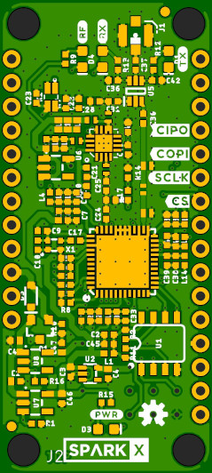
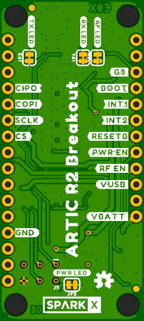

# ARGOS ARTIC R2 Breakout

A Thing Plus breakout to let us try the [ARGOS ARTIC R2 satellite communication chipset](https://www.cls-telemetry.com/argos-solutions/argos-products/modems/artic-chipset/#1534863095666-398318f3-c367)

Inspired by a request from Argentinian ornithologist Joaquín Cereghetti, this breakout should allow the user to send and receive messages anywhere but in a smaller package
and with lower power requirements than Iridium 9603N modem.

The ARGOS satellite system is restricted to specific applications:
- "To meet system use requirements, all programs using Argos have to be related in some way or other to environmental protection, awareness or study, or to protecting human life."

Joaquín would like to use the board to track birds such as flamingoes, at a lower price point than the commercially-available avian trackers (which can cost in the region of $4K each!).

## Repository Contents

- **/Documentation** - Datasheets etc.
- **/Hardware** - Eagle PCB, SCH and LBR design files

## License

**At the moment, it is not completely clear if we can call this project fully open-source. The datasheet and Icoteq / Arribada reference design were available on request only
and only the gerbers and an interactive pdf schematic were provided. We will need to talk to CLS to see if we can go fully OSHWA-compliant.**
